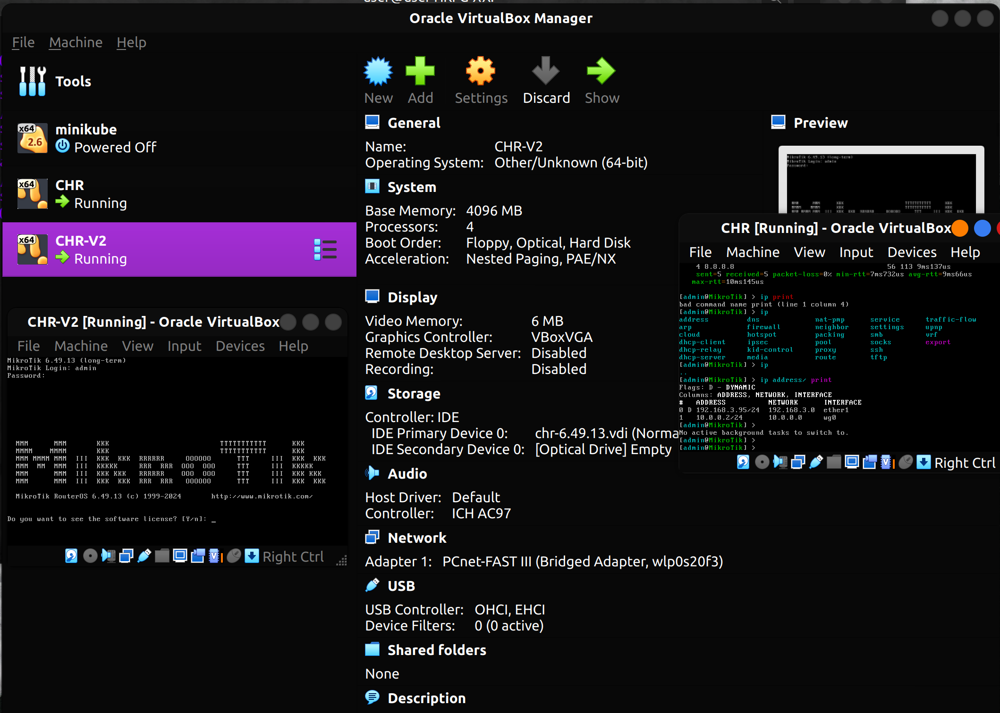
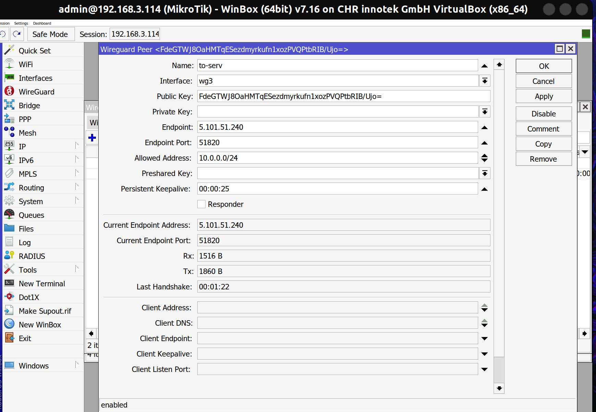
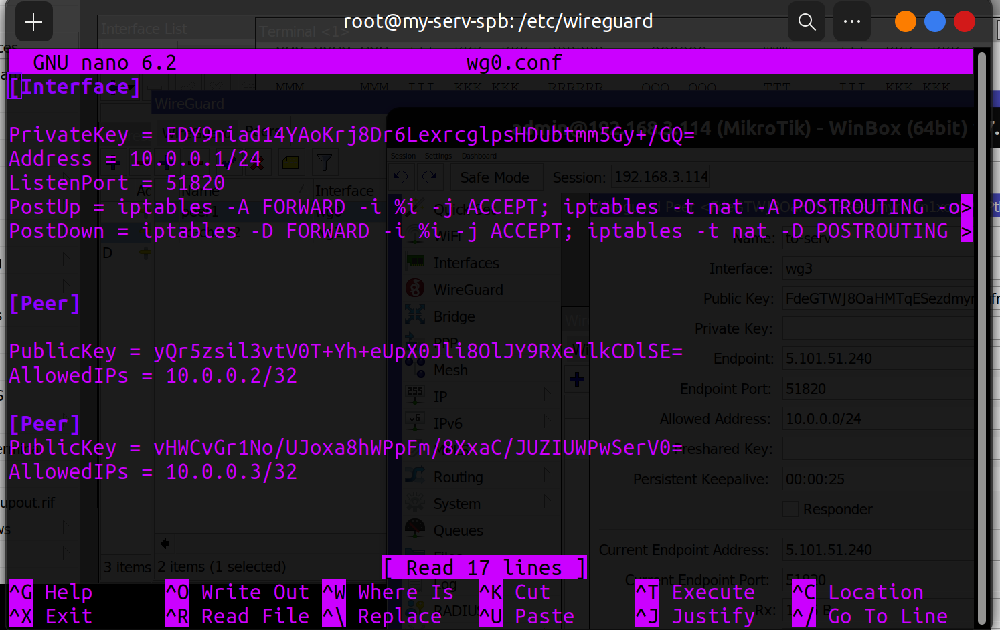
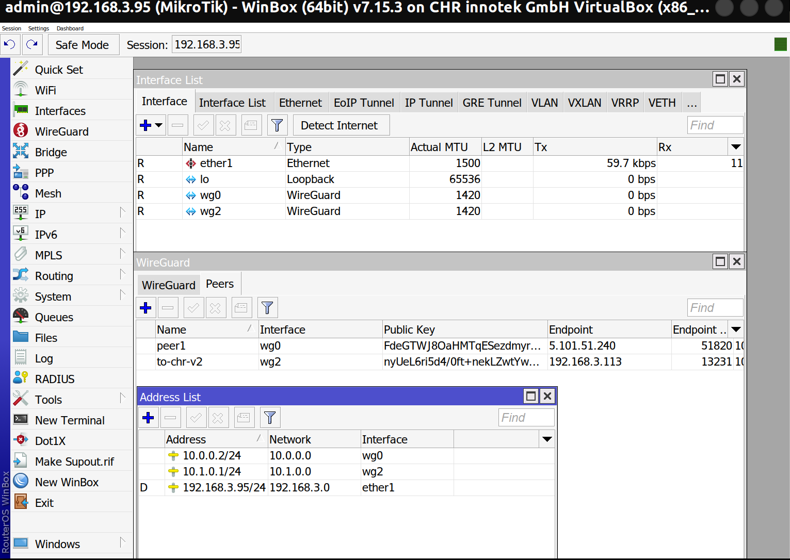
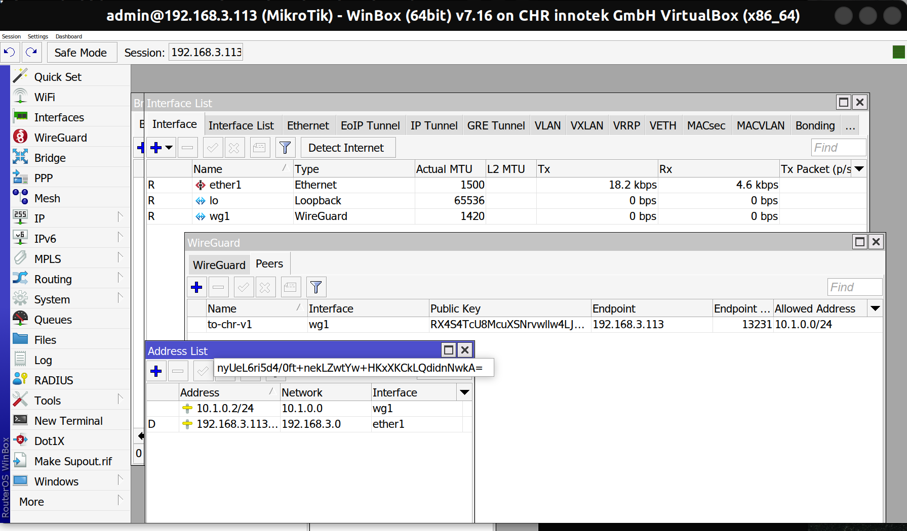
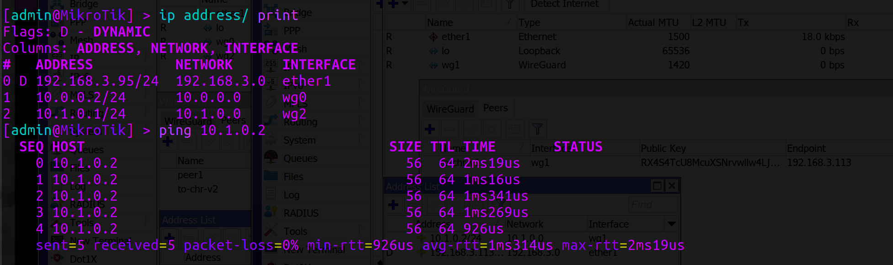
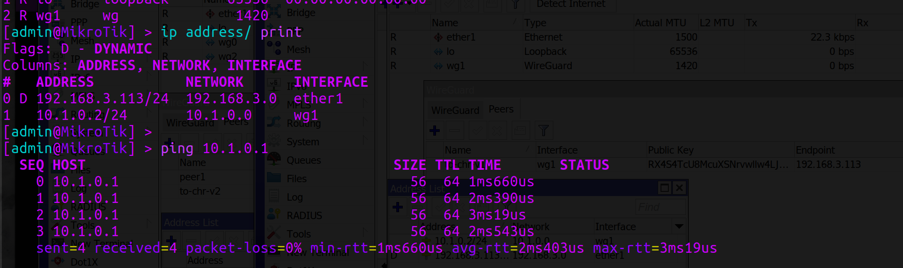
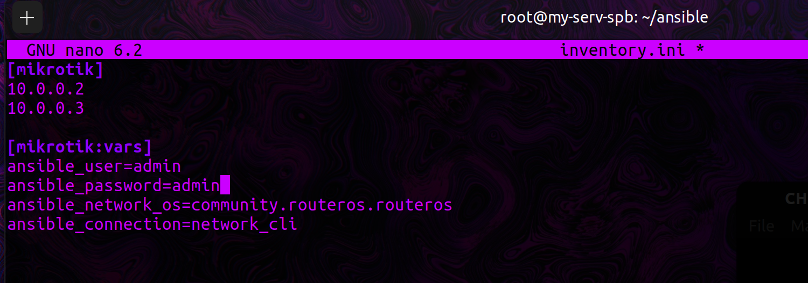

University: [ITMO University](https://itmo.ru/ru/)  
Faculty: [FICT](https://fict.itmo.ru)  
Course: [Network programming](https://github.com/itmo-ict-faculty/network-programming)  
Year: 2024/2025  
Group: K34212  
Author: Denis Fomintsev  
Lab: Lab2  
Date of create: 06.10.2024  
Date of finished: 06.10.2024  

## Лабораторная работа №2 "Развертывание дополнительного CHR, первый сценарий Ansible"

###  <a name="section0">Оглавление</a>
- [Оглавление](№section0)
- [Описание](#section1)
- [Цель работы](#section2)
- [Ход работы](#section3)
  - [Подготовка второго CHR устройств](#section3.1)
  - [Работа с Ansible](#section3.2)
- [Вывод](#section6)

## <a name="section1">Описание</a>
В данной лабораторной работе вы на практике ознакомитесь с системой управления конфигурацией Ansible, использующаяся для автоматизации настройки и развертывания программного обеспечения.  
## <a name="section2">Цель работы</a>
С помощью Ansible настроить несколько сетевых устройств и собрать информацию о них. Правильно собрать файл Inventory.
## <a name="section3">Ход работы</a> 

### <a name="section3.1">Подготовка второго CHR устройств</a> 
Соответственно первой лабораторной работе поднимим вторую ВМ с Microtik, подключимся к ней по Winbox и настроим Wireguard

<p align="center"></p>

Настроим новый интерфейс адаптера CHR-V2 для связи с сервером, обновим файл конфигурации на самом сервере

<p align="center"></p>

<p align="center"></p>

Настроим новый интерфейс адаптера для подключения двух ВМ CHR по Wireguard

Проверим связь CHR-V2 - Serv

* CHR-V1 (192.168.3.95)

<p align="center"></p>

* CHR-V2 (192.168.3.113)

<p align="center"></p>

Сразу проверяем связь

* CHR-V1 -> CHR-V2

<p align="center"></p>

* CHR-V2 -> CHR-V1

<p align="center"></p>

Можно явно заметить, что все устройства находятся в одной локальной сети, можно разрешить работу с различными подсетями, настроив маршрутизацию между подсетями.

```
iptables -A FORWARD -s 10.0.0.0/24 -d 10.2.0.0/24 -j ACCEPT
iptables -A FORWARD -s 10.2.0.0/24 -d 10.0.0.0/24 -j ACCEPT
```
### <a name="section3.2">Работа с Ansible</a>

1. Создадим файл инвентаря inventory  
   Это файл, который определяет список устройств.
<p align="center"></p>

1. Создадим playbook
   Это основной файл, где описаны задачи.


NTP (Network Time Protocol) — это протокол для синхронизации времени на компьютерах и сетевых устройствах. Он позволяет устройствам в сети поддерживать точное время, получая его от специализированных NTP-серверов.
## <a name="section4.6">Вывод</a> 
