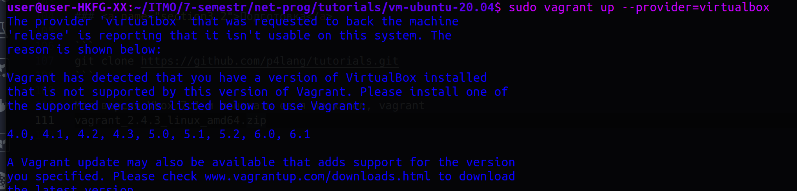
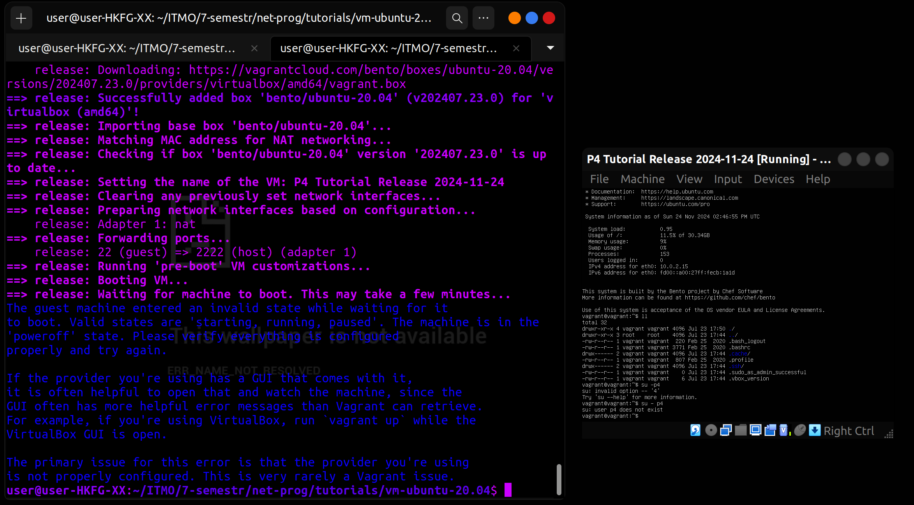

University: [ITMO University](https://itmo.ru/ru/)  
Faculty: [FICT](https://fict.itmo.ru)  
Course: [Network programming](https://github.com/itmo-ict-faculty/network-programming)  
Year: 2024/2025  
Group: K34212  
Author: Denis Fomintsev  
Lab: Lab2  
Date of create: 24.11.2024  
Date of finished: 24.11.2024  

## Лабораторная работа №4 "Базовая 'коммутация' и туннелирование используя язык программирования P4"

###  <a name="section0">Оглавление</a>
- [Оглавление](№section0)
- [Описание](#section1)
- [Цель работы](#section2)
- [Материал](#section2)
- [Ход работы](#section3)
  - [Теория](#section3.1)
  - [Подготовка](#section3.2)
  - [Implementing Basic Forwarding](#section3.4)
  - [Implementing Basic Tunneling](#section3.4)
- [Вывод](#section4)

## <a name="section1">Описание</a>
В данной лабораторной работе вы познакомитесь на практике с языком программирования P4, разработанный компанией Barefoot (ныне Intel) для организации процесса обработки сетевого трафика на скорости чипа. Barefoot разработал несколько FPGA чипов для обработки трафика которые были встроенны в некоторые модели коммутаторов Arista и Brocade.

## <a name="section2">Цель работы</a>
Изучить синтаксис языка программирования P4 и выполнить 2 задания обучающих задания от Open network foundation для ознакомления на практике с P4.

## <a name="section2.1">Материал</a> 

- [P4](#https://p4.org/p4-spec/docs/P4-16-v1.2.3.pdf)
- [p4lang/tutorials](#https://github.com/p4lang/tutorials)
- [Документация](#https://p4.org/specs/)

## <a name="section3">Ход работы</a> 

### <a name="section3.1">Теория</a>

P4 (Programming Protocol-Independent Packet Processors) — это специализированный язык программирования для работы с сетевым трафиком на уровне чипа. Он был разработан для создания программируемых сетевых устройств, таких как коммутаторы, маршрутизаторы или сетевые адаптеры.

P4 программы описывают обработку пакетов в программируемом сетевом устройстве. Архитектура делится на несколько этапов:

1. Headers (Заголовки).
Определяются заголовки пакетов (например, Ethernet, IPv4).

Пример:
```css
header ethernet_t {
    bit<48> dstAddr;
    bit<48> srcAddr;
    bit<16> etherType;
}
```

2. Parser (Парсер).
Логика извлечения заголовков из пакетов.

Пример:
```css
parser MyParser(packet_in pkt, out headers hdr) {
    state start {
        pkt.extract(hdr.ethernet);
        transition select(hdr.ethernet.etherType) {
            0x0800: parse_ipv4;
            default: accept;
        }
    }
}
```
3. Control (Контрольная логика)  
Управляет процессом обработки пакетов.

Пример:
```css
control MyIngress(inout headers hdr, inout metadata meta) {
    apply {
        if (hdr.ipv4.isValid()) {
            // Выполнить действия
        }
    }
}
```

4. Deparser (Обратный парсер)  
Собирает пакеты для передачи дальше.

> Основные компоненты P4  
Headers: описание формата заголовков пакетов.  
Metadata: дополнительные данные, которые используются внутри программы.  
Tables: правила обработки пакетов, основанные на значениях заголовков.  
Actions: набор инструкций, выполняемых при совпадении правил в таблицах.  
Control Flow: управление обработкой пакетов в пайплайне.  

Архитектура переносных сетевых карт (PNA) - это целевая архитектура, описывающая общие возможности сетевых сетевых карт, которые обрабатывают и пересылают пакеты между одним или несколькими сетевыми интерфейсами и хост-системой.  

Архитектура переносных коммутаторов (PSA) - это целевая архитектура, описывающая общие возможности сетевых коммутаторов для обработки и пересылки пакетов. 

Сетевая телеметрия (INT) - это основа для плоскости данных для сбора и передачи информации о состоянии сети без необходимости работы плоскости управления.  

Формат отчетов телеметрии определяет форматы пакетов для отчетов от устройств плоскости данных в распределенную систему мониторинга телеметрии.  

### <a name="section3.2">Подготовка</a>

```
git clone https://github.com/p4lang/tutorials.git
```

Моя версия Vbox 7.1, через репозитории apt install vagrant устанавливается версия 2.2.19, которая не поддерживает новые версии Vbox, более новые версии Vagrant 2.4 также этого не делают. Понижать версию Vbox до 6, я не хотел

<p align="center"></p>

Поэтому устанавливаем вручную бинарник ```vagrant_2.4.3_linux_amd64.zip```, далее ```unzip vagrant_2.4.3_linux_amd64.zip``` и ```sudo mv vagrant /usr/bin/```

Также принудительно меняем вывод версии для инструмента VBoxManage в /usr/bin/VBox

```
    VirtualBoxVM|virtualboxvm)
        exec "$INSTALL_DIR/VirtualBoxVM" "$@"
        ;;
    VBoxManage|vboxmanage)
    ########################
        if [[ $@ == "--version" ]]; then
           echo "7.0.0r164728"
        else
           exec "$INSTALL_DIR/VBoxManage" "$@"
        fi
        ;;
    ########################
    VBoxSDL|vboxsdl)
        exec "$INSTALL_DIR/VBoxSDL" "$@"
        ;;
```

Не очень классно, но вм создается

<p align="center"></p>
